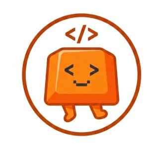
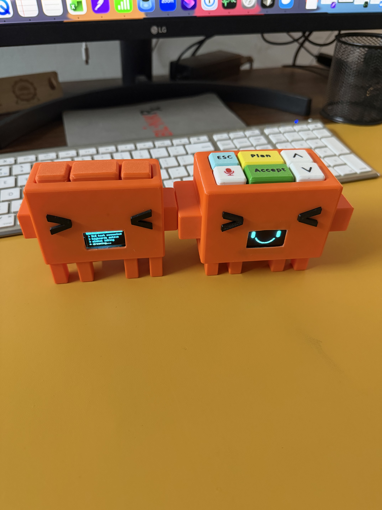

<p align="center">
  
</p>

<h1 align="center">Claude Pad</h1>

<p align="center">
  <em>A 3D-printed BLE macropad built for Claude Code. Press a button. Claude listens.</em>
</p>

<p align="center">
  
  
  
  
  
</p>

---

It connects over Bluetooth as a standard HID keyboard. No drivers. No app. Pair once, use forever.

You get one-press shortcuts for the actions you hit dozens of times a day in Claude Code — Plan, Accept, Escape, Mic — plus a touch sensor, a tiny animated OLED face that reacts to every press, and buzzer feedback that confirms each keystroke.

## Firmware versions

Two production-ready sketches are included.

### `ble_keyboard_3btn.ino` — compact build

Three core Claude Code actions, with Up/Down for navigation.

| Button | GPIO | Action |
|---|---|---|
| **PLAN** | 0 | `Shift + Tab` × 2 — opens plan mode |
| **ESC** | 1 | `Escape` — cancels |
| **ACCEPT** | 2 | `Enter` — accepts suggestion |
| **MIC** | 3 | Hold → `Space` — voice dictation |
| **DOWN** | 4 | `↓` Arrow Down |
| **UP** | 21 | `↑` Arrow Up |

### `claude-6btn-keyboard.ino` — full build (recommended)

Same layout, all six buttons fully mapped and polished.

### Chord shortcuts (both versions)

| Combo | Action |
|---|---|
| MIC + ACCEPT | `Cmd + C` — copy |
| ACCEPT + UP | `Cmd + [` — navigate backward |
| ACCEPT + DOWN | `Cmd + ]` — navigate forward |
| MIC + DOWN | `F5` — Mac dictation trigger |
| Touch sensor tap | `Cmd + Shift + )` — open Claude window |

## What's on the screen

The OLED runs at 50 FPS. The face changes with every button press.

| State | Trigger |
|---|---|
| 😐 Idle | Nothing pressed |
| 🚀 Rocket | ACCEPT pressed |
| 🎙️ Mic | MIC held |
| 📋 Plan | PLAN held |
| 💣 Escape | ESC pressed |
| 🔼 / 🔽 Look | UP / DOWN held |
| 💤 Sleep | Idle > 60 seconds |
| 🤸 Wake | First press after sleep, or touch tap |

## Hardware

| Part | Notes |
|---|---|
| ESP32-S3 Super Mini | Main MCU — BLE + USB-C |
| SSD1306 OLED 128×64 | I2C, 0.96" or 1.3" |
| Passive buzzer | PWM-driven via `ledc` |
| TTP223 capacitive touch sensor | Active-HIGH |
| 6× tactile buttons | Momentary, pulled HIGH internally |
| 3D-printed case | `3d-models/claude_keyboard.3mf` |

## Wiring

### OLED (I2C)

| OLED | ESP32-S3 |
|---|---|
| SDA | GPIO 8 |
| SCL | GPIO 9 |
| VCC | 3.3 V |
| GND | GND |

### Buttons — wire each between its GPIO and GND, no resistors needed

| Button | GPIO |
|---|---|
| PLAN | 0 |
| ESC | 1 |
| ACCEPT | 2 |
| MIC | 3 |
| DOWN | 4 |
| UP | 21 |

### Buzzer

| Pin | ESP32-S3 |
|---|---|
| + | GPIO 7 |
| − | GND |

### Touch sensor

| Pin | ESP32-S3 |
|---|---|
| SIG | GPIO 20 |
| VCC | 3.3 V |
| GND | GND |

### Status LED

GPIO 47 (active LOW) — blinks while advertising, solid when connected.

## Setup

**Board:** ESP32S3 Dev Module · USB CDC On Boot → Enabled · PSRAM → Disabled

**Libraries** (install via Library Manager):
- [NimBLE-Arduino](https://github.com/h2zero/NimBLE-Arduino) ≥ 1.4
- [U8g2](https://github.com/olikraus/u8g2) ≥ 2.35

Flash `claude-6btn-keyboard.ino`, open Serial Monitor at 115200 baud, then pair from Bluetooth settings. Device name: **Claude Keyboard**.

## 3D print

Open `3d-models/claude_keyboard.3mf` in Bambu Studio or PrusaSlicer.

- Layer height: 0.2 mm
- Infill: 15–20%
- Supports: none needed
- Material: PLA or PETG

## Files

```
claude-pad/
├── ble_keyboard_3btn.ino        # 3-button minimal firmware
├── claude-6btn-keyboard.ino     # 6-button full firmware (recommended)
├── 3d-models/
│   └── claude_keyboard.3mf      # enclosure print file
├── assets/
│   ├── logo.jpg                 # logo
│   └── photo.jpg                # finished build photo
└── README.md
```

## License

MIT — build one, share a photo.

---

<p align="center">
  
</p>
